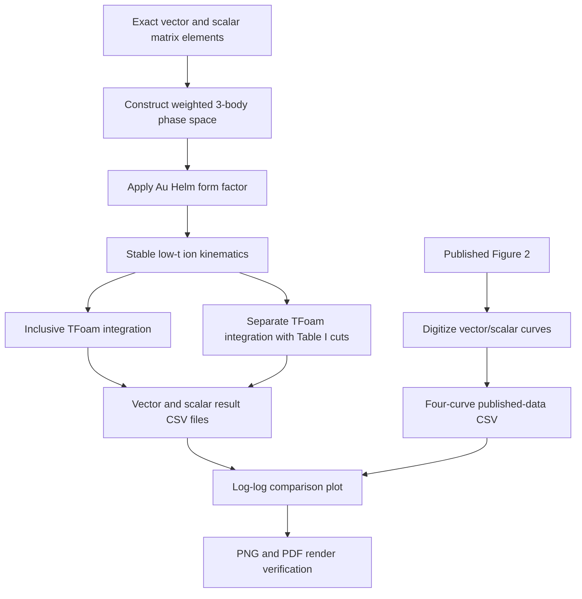

# Procedure used to create the vector–scalar comparison plot

## Purpose

The plot compares the cross sections published in Figure 2 of *Electron-Ion
Collider as a Discovery Tool for Invisible Dark Bosons* with an independent
integration of the vector- and scalar-boson processes. Both inclusive cross
sections and cross sections after the mass-dependent Table I cuts are shown.

## 1. Published reference curves

The black and red reference curves were digitized from the revised Figure 2
and stored in:

- `config/paper_figure2_digitized.csv`

The four published datasets are:

- vector inclusive;
- scalar inclusive;
- vector after Table I cuts;
- scalar after Table I cuts.

No scaling or fitting is applied to the published values in the displayed
plot.

## 2. Physics configuration

The independent calculation uses:

| Quantity | Value |
|---|---:|
| Electron beam energy | 18 GeV |
| Gold beam energy | 100 GeV per nucleon |
| Gold mass number | 197 |
| Gold charge | 79 |
| Gold-ion mass used numerically | 183 GeV |
| Electron coupling | `1e-4` |
| Process | `e Au -> e Au phi` |

The vector and scalar matrix elements are evaluated separately. The vector
calculation sums the three physical final-vector polarizations and averages
only over the incoming electron spin. The scalar calculation uses the exact
scalar reduced amplitude.

## 3. Phase-space integration

The three-body phase space is factorized into production of the outgoing gold
ion and an intermediate electron–boson system, followed by the decay of that
system. Four integration variables are sampled:

1. positive nuclear momentum transfer `t = QA2`, sampled logarithmically;
2. electron–boson invariant mass `m_ephi`, sampled linearly;
3. decay polar angle `cos(theta*)`;
4. decay azimuth `phi*`.

Every event carries its Monte Carlo integration weight. Cross sections and
acceptances are calculated from weighted sums or direct weighted integration;
events are never treated as equally weighted counts.

The implemented measure is differential in `dm_ephi`. Consequently, the
linear-mass Jacobian is used. No additional `2*m_ephi` factor is applied.

## 4. Nuclear form factor and low-mass treatment

The calculation uses the Helm form factor stated in the paper,

`F(t) = 3 j1(sqrt(t) R1)/(sqrt(t) R1) * exp(-t rho^2/2)`,

with `R1 = 1.1 A^(1/3) fm` and `rho = 0.9 fm`.

The independent curves shown in the plot are **unscreened**:

- no atomic-screening factor is included;
- no artificial minimum `QA2` is imposed;
- the physical kinematic lower bound is used.

For the very small momentum transfers encountered at low boson mass, the
outgoing ion direction is constructed from `1-cos(theta_A)` using 50-digit
arithmetic. This avoids subtracting nearly equal large numbers. The sampled
`QA2` and the value reconstructed from the generated ion four-vectors were
checked to agree after this correction.

## 5. Laboratory observables and Table I cuts

The outgoing electron is boosted to the collider laboratory frame. The
selection variables are then calculated as:

- `pT_e`: outgoing-electron transverse momentum in the laboratory;
- `eta_e`: outgoing-electron pseudorapidity, with the gold beam along `+z`;
- `E_e`: outgoing-electron laboratory energy;
- `Qe2 = -(p_e,in - p_e,out)^2`.

For every mass, the corresponding Table I row is applied exactly. For example,
at 1 GeV the requirements are:

- `Qe2 > 10^0.2 GeV2`;
- `pT_e > 1.3 GeV`;
- `-3.5 < eta_e < 2.0`;
- `E_e < 10 GeV`.

The selected cross section is integrated in a separate TFoam run with the cuts
inside the integrand. This prevents the rare selected region from being poorly
estimated using a finite inclusive event sample.

## 6. Regenerated low-mass points

After correcting the forward-ion construction, the inclusive and selected
integrations were rerun independently at:

- 0.010 GeV;
- 0.032 GeV;
- 0.100 GeV;
- 0.316 GeV.

The regenerated results replaced the corresponding rows in:

- `results/vector_scan_fresh.csv`;
- `results/scalar_scan.csv`.

The stable central- and high-mass results from the earlier exact integrations
were retained.

## 7. Plot construction

The plotting program is:

- `scripts/plot_vector_scalar.py`

It reads the published digitization and the two independent result files, then
uses logarithmic mass and cross-section axes. The visual encoding is:

| Color/style | Meaning |
|---|---|
| Black | Published inclusive |
| Red | Published after Table I cuts |
| Green | Independent inclusive |
| Purple | Independent after Table I cuts |
| Solid | Vector boson |
| Dashed | Scalar boson |

The final outputs are:

- `plots/vector_scalar_cross_section_validation.png`;
- `plots/vector_scalar_cross_section_validation.pdf`.

The PDF was rendered back to an image and visually checked for line, label,
legend, and axis problems.

## 8. Interpretation limitation

The plot is a comparison, not a forced reproduction. Under the equations and
unscreened Helm form factor stated in the paper, the independent inclusive
calculation remains larger at the lowest masses. Standard atomic screening and
one fixed `QA2` cutoff were tested separately and neither reproduces the full
published low-mass curve. The independent post-cut scalar and vector curves
also remain approximately a factor of three below the published red curves.

These differences are displayed rather than removed because the revised paper
does not provide the event sample, cutflow, low-`QA2` regularization, or code
needed to reconstruct those choices.
